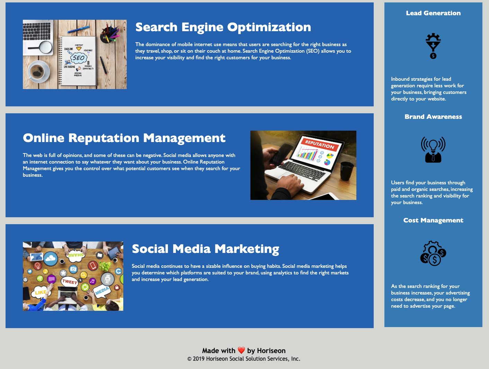

# Code Refactor

<p>
    
    
</p>


## Table of Contents
1. [Description](#description)
2. [User Story](#user-story)
3. [Screenshot](#screenshot)
4. [Deployed Application](#deployed-application)
5. [Installation](#installation)
6. [License](#license)
7. [Contributing](#contributing)
8. [Test](#test)
9. [Questions](#contact-information)

## Description
You are given a starter code which you'll update with sematic HTML elements following a logical structure independent of styling and positioning, update the accessible alt attribute in the icon and image elements, update the heading attributes in sequential order, and update the title element to be more concise and descriptive. 

## User Story
```
AS A marketing agency
I WANT a codebase that follows accessibility standards
SO THAT our own site is optimized for search engines
```

## Screenshot



## Deployed Application
* https://shelldan.github.io/code-refactor/

## Installation
To clone the repo:
```
git clone https://github.com/shelldan/code-refactor.git
``` 

## License
[](https://opensource.org/licenses/MIT) 

## Contributing 
There is no contribution allowed at this time.

## Test
There is no test available at this time. 


## Contact Information
* GitHub Username: [shelldan](https://github.com/shelldan)